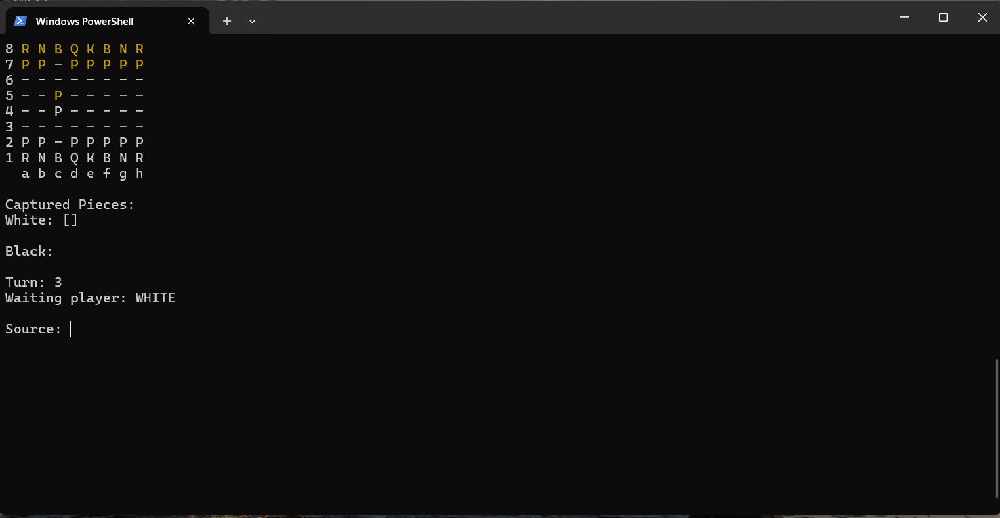

# Chess System Java

A complete chess game for two players, played in the **terminal**, written in pure Java with no external libraries.

This project was built as part of a Java course (Udemy) to practice object-oriented programming: layered architecture, inheritance, polymorphism, encapsulation, abstract classes and custom exceptions.



## Features

- 8×8 board drawn in the terminal with ANSI colors (white pieces in white, black pieces in yellow)
- Highlighting of possible moves after choosing a piece
- Turn control and alternating players
- Captured pieces list for each color
- **Check** and **checkmate** detection
- Illegal moves are blocked (you can't leave your own king in check)
- Special moves:
  - **Castling**, king side and queen side
  - **En passant**
  - **Promotion**: choose Bishop, Knight, Rook or Queen

## How to play

Enter positions in chess notation: **column (a–h) + row (1–8)**, like `e2`.

1. `Source:` type the position of the piece you want to move (e.g. `e2`).
2. The board shows where that piece can go.
3. `Target:` type the destination (e.g. `e4`).
4. If a pawn reaches the last row, pick the new piece: `B`, `N`, `R` or `Q`.

The game ends when one side is in checkmate.

| Letter | Piece  |
|--------|--------|
| `K`    | King   |
| `Q`    | Queen  |
| `R`    | Rook   |
| `B`    | Bishop |
| `N`    | Knight |
| `P`    | Pawn   |

## Requirements

- **JDK 17 or newer.** The Eclipse project is configured for Java SE 25.
- A terminal that supports ANSI colors, such as Windows Terminal / PowerShell, Git Bash, or any Linux/macOS terminal.

> The old Windows `cmd.exe` console may not show colors, and it won't clear the screen correctly.

## Running

### Option 1: Eclipse

Import the project (`File > Import > Existing Projects into Workspace`) and run `application.Program`.

Eclipse's built-in console does not understand ANSI codes, so the colors look wrong there. For the best result, run it in a real terminal (Option 2).

### Option 2: Terminal

Clone the repository:

```bash
git clone https://github.com/PedroSgorla/chess-system-java.git
cd chess-system-java
```

Compile and run on **Windows (PowerShell)**:

```powershell
javac -d bin (Get-ChildItem -Recurse -Filter *.java src).FullName
java -cp bin application.Program
```

Compile and run on **Linux / macOS / Git Bash**:

```bash
javac -d bin $(find src -name "*.java")
java -cp bin application.Program
```

## Project structure

```
src/
├── application/        # User interface (console)
│   ├── Program.java    # Main game loop
│   └── UI.java         # Draws the board, reads input, ANSI colors
├── boardgame/          # Generic board layer (knows nothing about chess)
│   ├── Board.java
│   ├── Piece.java
│   ├── Position.java
│   └── BoardException.java
└── chess/
    ├── layer/          # Chess rules layer
    │   ├── ChessMatch.java     # Turns, check, checkmate, special moves
    │   ├── ChessPiece.java
    │   ├── ChessPosition.java  # Converts "e2" <-> matrix position
    │   ├── Color.java
    │   └── ChessException.java
    └── pieces/         # One class per piece, each with its own move rules
        ├── King.java  ├── Queen.java  ├── Rook.java
        ├── Bishop.java ├── Knight.java └── Pawn.java
```

The code has three layers, and each one only depends on the layer below it:

- **`boardgame`** is a generic board with pieces and positions. It could be reused for checkers or any other board game.
- **`chess`** adds the chess rules on top of the board.
- **`application`** is the only layer that talks to the user.

This separation means the rules never depend on the console. You could swap the terminal UI for a graphical one without touching `ChessMatch`.

## Technologies

- Java (standard library only)
- ANSI escape codes for colors and clearing the screen

## Author

**Pedro Sgorla**. [GitHub](https://github.com/PedroSgorla)
